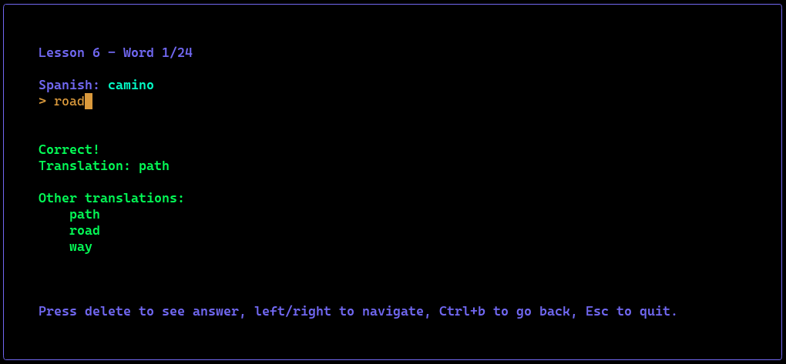

*Lomo*
___



Lomo is a simple language learning tool built for the purpose of language learning. It's a simple way to start learning a language, and should be to augment language learning by repeated exposure to the most common words in the language to help you bootstrap your vocabulary so you can move onto deeper learning. 

The tool is best used alongside various memory tecnhiques such as Mnemonics and spaced repetition. I find saying the words out loud as I enter them helps to increase retention as well. If you're not sure of the pronuciation, you can use a tool like Google Translate to hear the word spoken aloud.

**Installation**
_____

Right now I don't have a way to distribute this tool, so you'll need to clone the repository and run it locally.
If there is ever enough interest, I may package it up for easier installation.


Pre-requisites:
[golang])(https://go.dev/) 1.20 or higher
[git](https://git-scm.com/downloads)
[make](https://www.gnu.org/software/make/)

Steps:

Clone the repository:
```bash
git clone https://github.com/decarlec/lomo.git
cd lomo
make db_bootstrap // This will create the database and populate it with some initial data
make run // This will start the application in your terminal

```
